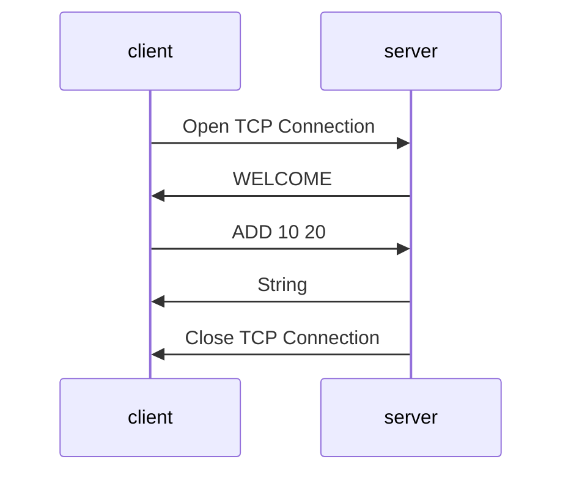
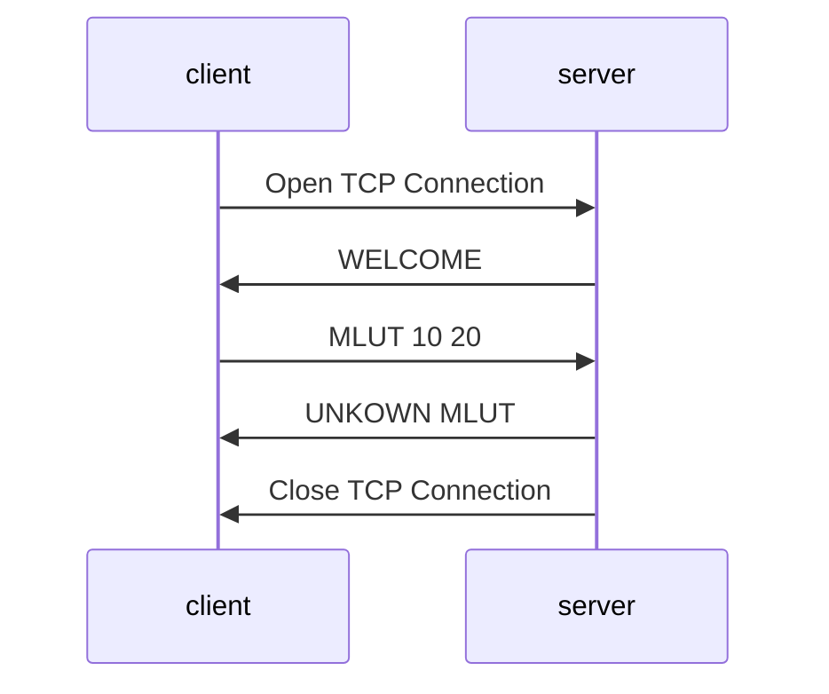
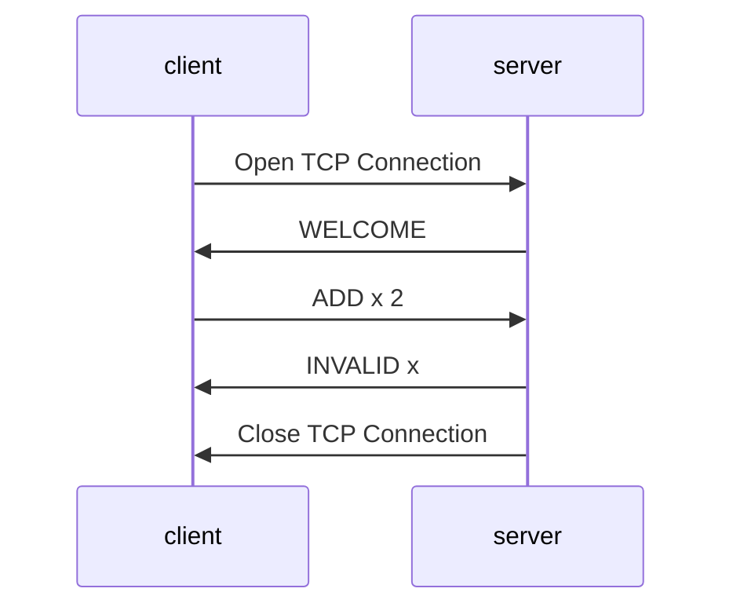
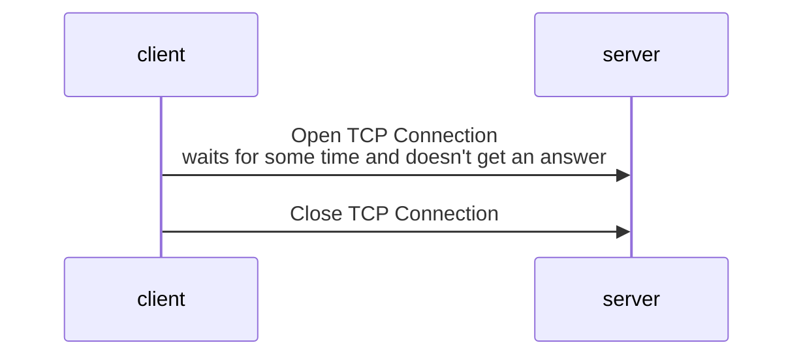
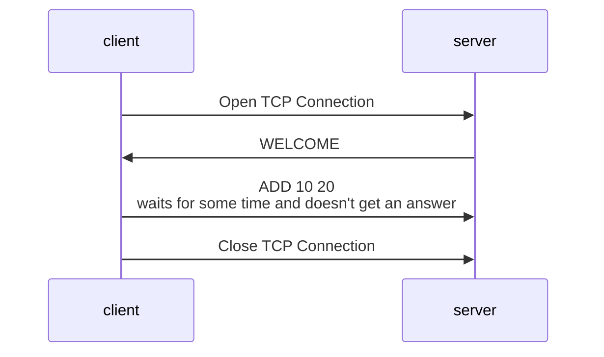
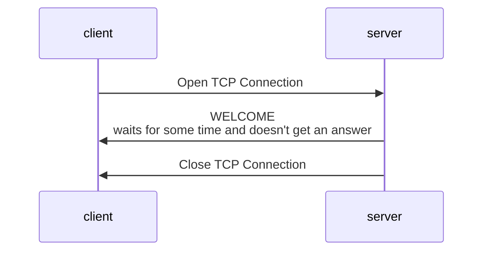

# Specification

## Overview

Calculator is a server-client application that can be used to do computations.
The server can perform computations such as "ADD 10 20" and sends the result to the client. 
The client reads user inputs from stdin, sends them to the server and displays the result.
The server checks if the user input is valid and send an error message if it isn't.

## Transport Layer Protocol

Calculator uses TCP. The client establishes the connection and has to know the IP address of the server.
The server listens on TCP port 2828.
The server closes the connection when the result of the operation or the error message has been sent.
The server or the client can close the connection after a timeout.

## Messages

There are X types of messages:

- `WELCOME` When the connection is established, the server sends the supported operations in a welcome message.
- `ADD <operand 1> <operand 2>`
The client sends an addition to be computed. The operands are real numbers.
- `SUB <operand 1> <operand 2>`
  The client sends a subtraction to be computed. The operands are real numbers.
- `MULT <operand 1> <operand 2>`
  The client sends a multiplication to be computed. The operands are real numbers.
- `UNKOWN <operationName>`
Error response message after a client message, if the operation does not exist (i.e. is something else than ADD).
- `INVALID <operand>`
Error response message after a client message, if one of the operands isn't a number.

Both messages are UTF-8 encoded with “\n” as end of line character.
If the operation can be computed, the server sends the result as a String.

## Specific elements

### Error Handling

The server has a list `allowedOperations` that contains the name of the valid operations. 
It can use it to check if a message sent by the  server is legal. 
If it isn't, the server sends the error message.

### Extensibility

You can add more operations in the future. You have to add its name to `allowedOperations`, add a new routine and a
new error message, if needed.

## Example Dialogs

### Successful Operation Computation

### Unkown Operation

### Invalid Operand

## Ideas for improvement

### Timeout

