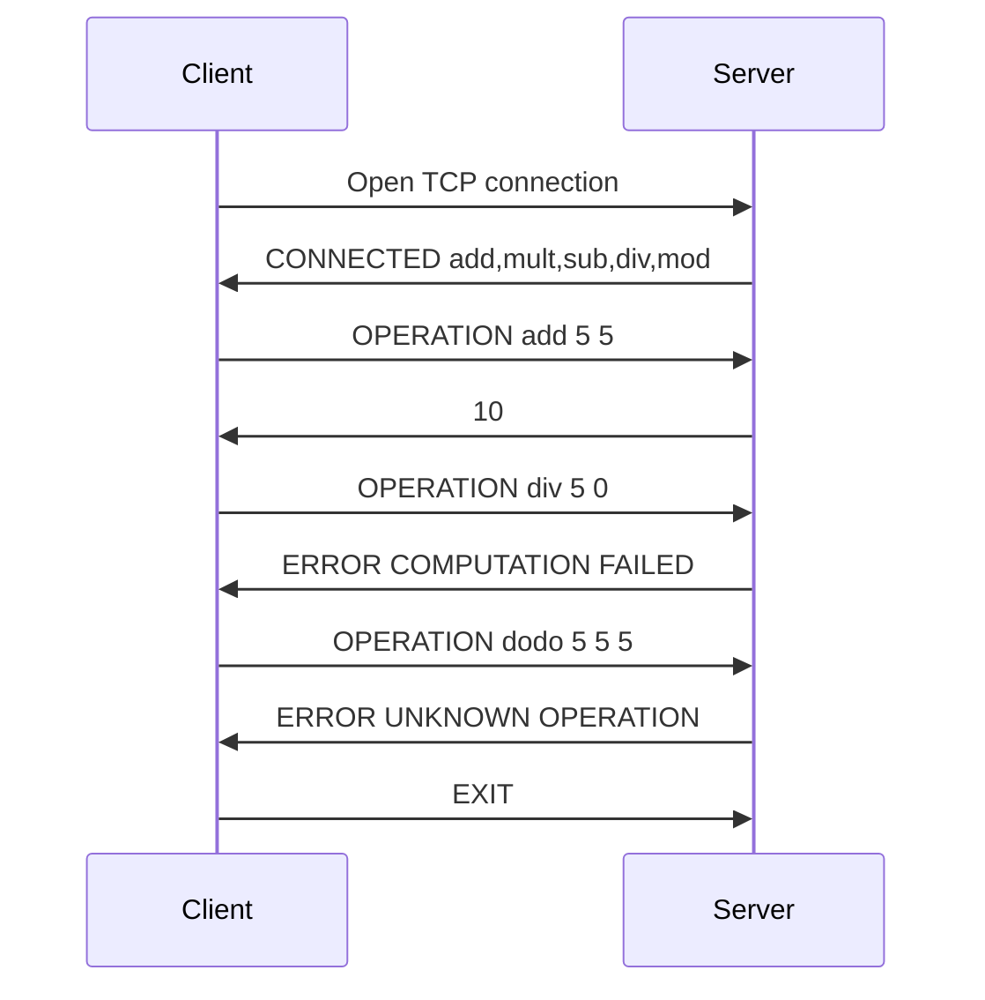

Summary protocol specification

1. Overview

   - Client-server protocol. The client connects to the server and request a computation. The server sends the result or an error message, if the operation is not known or if the result can't be calculated.

2. Transport layer protocol

   - The calculator uses TCP. The client establishes the connection. It has to know the IP address of the server. The server listens on TCP port 12345. The server send the requested result or an error message. The client closes the connection when wanted.

3. Messages
   - Client speak first and will close the connection too. Client will wait server response before speaking again.
   - There are 5 types of messages.
     - `OPERATION <operation> <operand1> <operand2>` : The client request an operation applied to two numbers.
     - `EXIT` : The client request the closure of the connection. 
     - `CONNECTED <functionnalities>` : The server send all possibles operations on successful connection.
     - `ERROR UNKNOWN OPERATION` : Error response message from the server, if the operation does not exist (operation or number of operand).
     - `ERROR COMPUTATION FAILED` :  Error response message from the server, if the computation failed.
   - Messages are UTF-8 encoded with `\n` as end-of-line character.

4. Example dialogs examples of one or several  dialogs to clarify the scenarios

