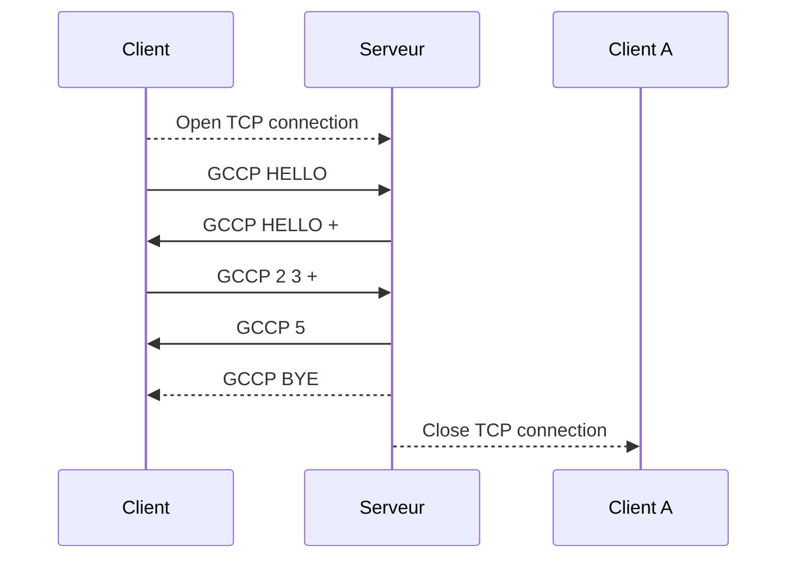
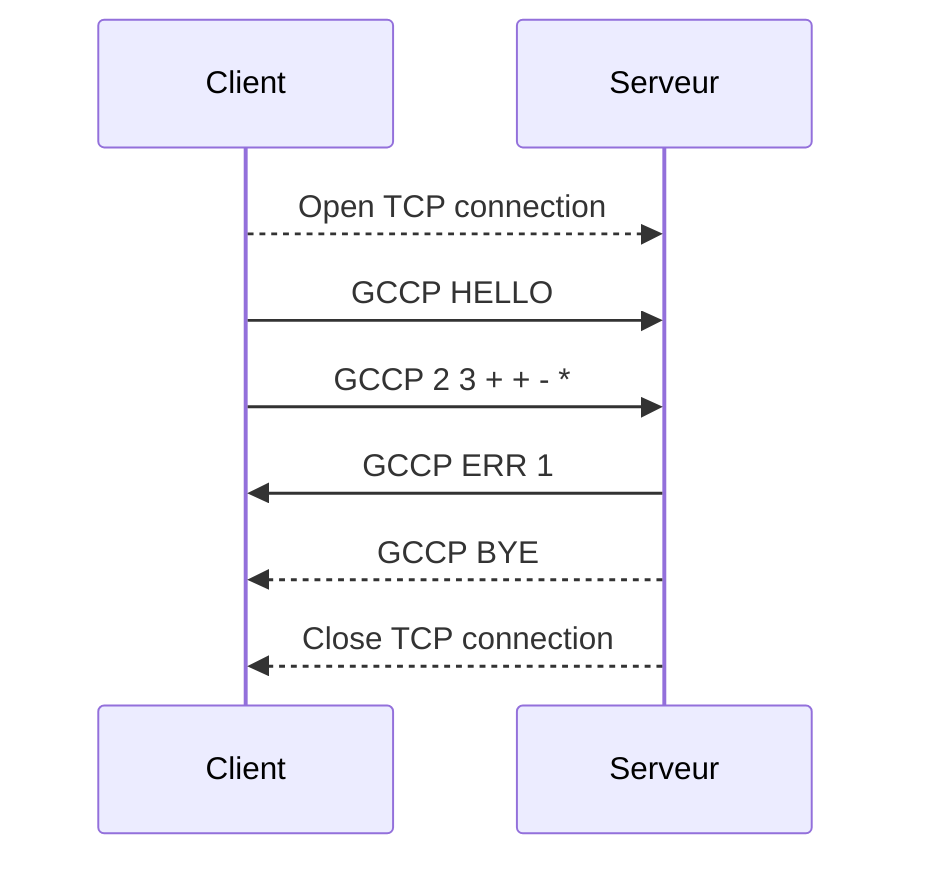

# DAI - Lab 03 - Protocol Design

## Table of contents

- [1. Overview](#1-overview)
- [2. Transport layer](#2-transport-layer)
- [3. Messages format](#3-messages-format)
- [4. Specificities](#4-specificities)
    - [4.1 Authentication](#41-authentication)
    - [4.2 Security](#42-security)
    - [4.3 Mathematical objects](#43-mathematical-objects)
        - [4.3.1 Operations](#431-operations)
        - [4.3.2 Operands](#432-operands)
        - [4.3.3 Constants](#433-constants)
        - [4.3.4 Functions](#434-functions)
    - [4.4 Errors](#44-errors)
    - [4.5 Concurrency](#45-concurrency)
    - [4.6 Additional capabilities](#46-additional-capabilities)
- [5. Diagram](#5-diagram)
    - [5.1 Successful communication](#51-successful-communication)
    - [5.2 Erroneous communication](#52-erroneous-communication)

## 1. Overview

The **Green Cat Calculation Protocol** (GCCP) protocol is a text-based protocol that allows users to do mathematical
calculations on a server. The protocol is based on a client-server architecture where the client communicates with the
server to get a computation done. The client initiates the connection with a special message, to which the server
answers with a list of its capabilities. The client can then send the request to the server and the server will respond
with the result of the computation. The server will then close the connection with a special message. The client can
alternatively ask the server to close the connection prematurely. The messages are sent in raw text format, with
classical mathematical symbols denoting operations and expressions formulated
in [Reverse Polish Notation (RPN)](https://en.wikipedia.org/wiki/Reverse_Polish_notation). The symbols of the expression
must be separated by a whitespace character. It is possible to do more than one operation in a single expression.

## 2. Transport layer

The protocol will use TCP and the port 51740 for 0xCA1C. The client will initiate the communication with a special
message and the server will respond with a special message as well. The client will then send the request and the server
will respond with the
result.

## 3. Messages format

The messages are sent in UTF-8 encoding and are always a single line terminated by a single newline character. The
maximum
length for a message is 8192 characters.

The client will send a message to the server to initiate the communication. The message will be in the following form :

```
GCCP HELLO
```

The server will respond with a message in the following form :

```
GCCP HELLO <OPERATIONS>
Example : GCCP HELLO + * / sin ln
```

The client may then ask the server to close the connection prematurely with a message in the following form :

```
GCCP BYE
```

The client will then send a message to the server to request a computation. The message will be in the following form :

```
GCCP <REQUEST> 
Example : CALC 2 3 +
          CALC 2 3 + 4 *
          CALC 2 3 + 4 * 5 6 + *
```

The server will respond with a message in the following form :

```
GCCP <RESULT>
or
GCCP ERR <errno>
```

The server will then close the connection with a message in the following form :

```
GCCP BYE
```

## 4. Specificities

### 4.1 Authentication

No authentication is required for the protocol.

### 4.2 Security

The protocol implements a very basic security mechanism by ciphering the messages between the client and the server
using Base64 encoding.

### 4.3 Mathematical objects

#### 4.3.1 Operations

The server must support the following operations :

- Addition using the `+` symbol
- Subtraction using the `-` symbol
- Multiplication using the `*` symbol
- Division using the `/` symbol
- Exponentiation using the `^` symbol
- Square root using the `√` symbol
- Factorial using the `!` symbol

Other operations may be supported.

#### 4.3.2 Operands

The operands must be positive integers or floating-point numbers with a maximum of 6 digits after the decimal point.

#### 4.3.3 Constants

The project must support the $\pi$, $\e$ and $\phi$ mathematical constants. Other constants may be supported.

#### 4.3.4 Functions

The server must handle the following transcendental functions :

- Sine
- Cosine
- Tangent
- Natural logarithm

Other functions may be supported.

### 4.4 Errors

The server must handle the following errors :

| Error code | Description           | Example                                            |
|------------|-----------------------|----------------------------------------------------|
| 01         | Syntax error          | `CALC 2 3 + + - *   `                              |
| 02         | Logic error           | `CALC 2 0 /`                                       |
| 03         | Internal error        | Server is out of memory. Operation overflows       |
| 04         | Unsupported operation | `CALC 2 3 =`                                       |
| 05         | Invalid input         | The message is malformed. The message is too long. |

The server will answer with an error code and the client is in charge of displaying a helpful error message for the
user.

### 4.5 Concurrency

The server is only able to handle one connection per client at a time. Different clients can connect to the server at
the same time.

### 4.6 Additional capabilities

A server-specific Easter-egg may be available when sending the "🟢🐱" (Green Cat) sequence instead of an expression in
the opening `GCCP` message.

## 5. Diagram

### 5.1 Successful communication

The following diagram shows a successful communication between a client and a server :



### 5.2 Erroneous communication



