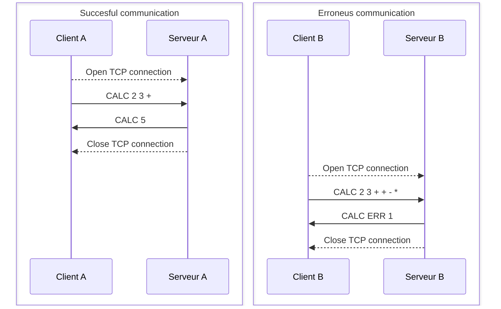

# DAI - Lab 03 - Protocol Design

## Overview

The `calc` protocol is a text-based protocol that allows users to do mathematical calculations on a server. The protocol
is based on a client-server architecture, with a single exchange where the client sends a request to the server and the
server responds with the result of the calculation. The messages are sent in raw text format, with mathematical symbols
denoting operations and operations formulated in reverse polish notation. It is possible to do more than one operation
at a time in a single message. Only arithmetical operations are supported

## Transport layer

The protocol will use TCP and the port 51740 for 0xCA1C. The client will initiate the communication with a special
message and the server will
respond with a special message as well. The client will then send the request and the server will respond with the
result.

## Messages format

The messages are sent in raw text format, with mathematical symbols denoting operations and operations formulated in [
RPN](https://en.wikipedia.org/wiki/Reverse_Polish_notation). The server may also provide some mathematical functions, in
which cas it will announce it in it's HELLO reply.
The messages are sent in UTF-8 encoding.
The messages will always be a single line terminated by a single newline character.

The client will send a message to the server to initiate the communication. The message will be in the following form :

```
CALC <REQUEST> 
Example : CALC 2 3 +
          CALC 2 3 + 4 *
          CALC 2 3 + 4 * 5 6 + *
```

The server will respond with a message in the following form :

```
CALC <RESULT>
ou
CALC ERR <errno>
```

## Specificities

### Operations

The supported arithmetical operations are specified in the [following Wikipedia
pag](https://en.wikipedia.org/wiki/Glossary_of_mathematical_symbols#Arithmetic_operators)

### Symbols

The project supports the $\pi$, $\e$ and $\phi$ constants.

### Functions

The server understands the following functions :

- Sine
- Cosine
- Tangent
- Natural logarithm

### Errors

The following errors may be raised :

0x1 SYNTAX
0x2 LOGIC
0x3 INTERNAL
0x4 UNSUPPORTED

The server will answer with an error code and the client is in charge of interpreting it.

### Additional capabilities

An easter egg will be available when sending the "🟢🐱" (greencat) sequence instead of the opeartion in the opening `CALC`
message.

## Diagram



