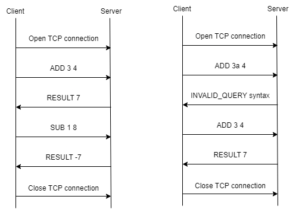

# Specifications - ptcalc

## Overview
ptcalc is a client-server protocol. The client requests a calculation between two numbers and the server returns the result. The server check whether there is an error in the query and display an error message.

## Transport layer protocol

ptcalc uses TCP. The client establishes the connection. It has to know the IP address of the server. The server listens on TCP port 54321.

The client closes the connection when he is done with his queries.

## Messages

There are three types of messages:

- `OPERATION <operand1> <operand2>` : The client requests an operation between two numbers (ADD, SUB, MUL, DIV)
- `INVALID_QUERY <error_type>` : The server response with an error message specifying where the error come from (operand, operator, syntax, ...) 
- `RESULT <value>` : The server returns the result of the operation if there is no error

## Example dialogs

