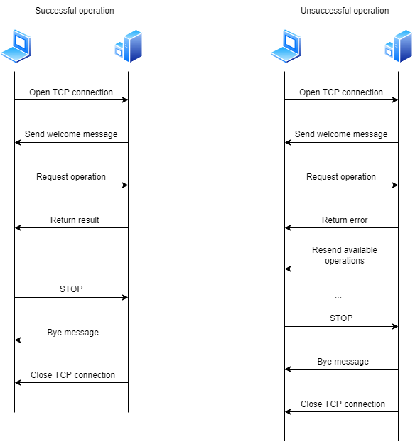

## Intro
We want to implement a simple protocol to make a numeric operation:
1. The server sends a welcome message with availabe commands and operations.
2. The client requests a calculation on two operators (double).
3. The server sends the answer or an error message
4. The client can request another operation or decide to stop the communication.
5. The server closes the connection once it receives the STOP message.

## Overview
OPON (operations on the network) is a client-server protocol. The client connects to a server that sends the available operations in a welcome message. The client then requests a calculation (addition or multiplication) on two operators of type double and the server answers with the result or an error message with a status code, if something went wrong. In that case, if the client request was not compliant with the supported list of operations, the server sends the supported operations again. The server keeps listening to the cleint requests until the client doesn't decide to stop the exchange. At that point, the server closes the connection after sending a "bye" message.

## Transport layer protocol
OPON uses TCP. The client establishes the connection. It has to know the IP address of the server. The server listens on TCP port 1234.
The server closes the connection when the STOP message has been sent by the client.

## Messages
The server welcome message:
"""
Welcome
Supported operations:
ADD <num1> <num2> -> this returns num1 + num2
MUL <num1> <num1> -> this returns num1 * num2
STOP -> this stops the connection
"""

The client requests the calculation:
1. For addition: ADD <num1> <num2>
2. For multiplication: MUL <num1> <num2>
3. For stopping exchange: STOP

If the operation is successful, the server directly sends the result. Otherwise, it sends an error message with the corresponding status code. Examples:
1. Response message: 5.5
2. Error response message:
"""
Error code: 1
The given operation is not supported. Supported operations are: ADD for addition and MUL for multiplication.
Supported operations:
ADD <num1> <num2> -> this returns num1 + num2
MUL <num1> <num1> -> this returns num1 * num2
STOP -> this stops the connection
"""

When the client decides to stop the exchange by sending "STOP", the server replies "Bye!" and closes the connection.

## Specific elements
Error response message if:
1. Unknown operation -> error code 1. Message: The given operation is not supported. Supported operations are: ADD for addition and MUL for multiplication.
2. Numbers in wrong format (for example, letters instead of digits) -> error code 2. Message: The given arguments are not well formatted. Please provide two double or integer numbers.
3. Wrong number of arguments (for example, 5 arguments given instead of 3) -> error code 3. Message: Too many arguments given! Please send only one instruction for the operation and two floating point or integer numbers!

Messages are UTF-8 encoded, with “\n” as end-of-line character.

## Exemple dialogs
