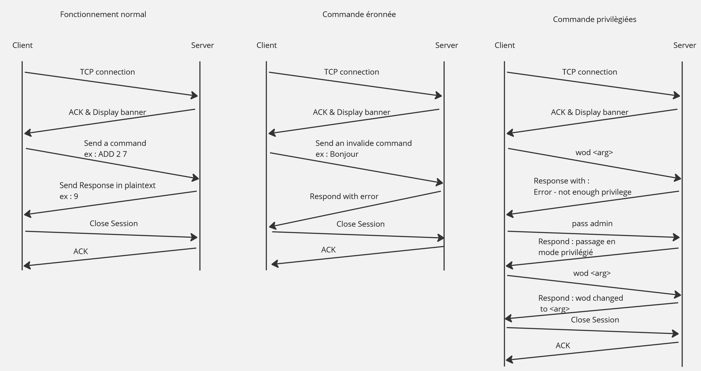

# Protocole FBP
## Romain Fleury, Dr. Ing. Julien Billeter

### Vue générale
Dans le protocole FBPm un client se connecte à un serveur. Le client envoie une commande (avec ou sans arguments), et le serveur envoie une réponse ou un message d'erreur si la commande n'est pas reconnue (ou que les arguments de la commande ne sont pas valides).
Le client peut s'authentifier pour accéder à des commandes privilégiées (en mode administrateur).

### Protocole de la couche Transport
Le protocole FBP utilise TCP comme protocole de transport. Le client établit une connexion TCP avec le serveur sur une adresse IP donnée et le serveur écoute sur le port 1234.
Le client envoie la commande ```EXIT``` (ou ```QUIT```) pour fermer la connexion. Le serveur n'a pas de *timeout*.

### Messages
Les commandes supportées sont indiquées ci-dessous. Ces commandes sont notées en majuscule (p.ex. ```BING```), mais elles fonctionnent aussi en minuscule (```bing```), et en minuscule débutant par une majuscule (```Bing```).

#### Opérateurs et commandes en mode utilisateur
Les opérateurs arithmétiques et commandes suivantes sont supportées en mode utilisateur : 

##### Opérateurs arithmétiques unaires

- ```NEG <arg>```                 : opposé de ```<arg>``` (i.e. -```<arg>```)
- ```INV <arg>```                 : inverse de ```<arg>``` (i.e. 1 / ```<arg>```)
- ```SQRT <arg>```                : racine carrée de ```<arg>```
- ```LN <arg>``` (ou ````LOG````) : logarithme naturel de ```<arg>```
- ```LOG10 <arg>```               : logarithme de base 10 de ```<arg>```
- ```EXP <arg>```                 : exponentielle (base e) de ```<arg>```
- ```POW2 <arg>```                : carré de ```<arg>``` (i.e. ```<arg>``` ^ 2)
##### Opérateurs arithmétiques binaires
- ```ADD <arg1> <arg2>``` (ou ```+```)  : addition (```<arg1> + <arg2>```)
- ```SUB <arg1> <arg2>``` (ou ```-```)  : soustraction (```<arg1> - <arg2>```)
- ```MULT <arg1> <arg2>``` (ou ```*```) : multiplication  (```<arg1> * <arg2>```)
- ```DIV <arg1> <arg2>``` (ou ```/```)  : division  (```<arg1> / <arg2>```)
- ```POW <arg1> <arg2>``` (ou ```^```)  : puissance n-ième  (```<arg1> ^ <arg2>```)
- ```LOG_B <arg1> <arg2>```             : logarithme de base b  (```log_<arg2>(<arg1>)``` ou ```<arg2>``` est la base du logarithme)
##### Commandes (sans arguments)
- ```QUIT``` (ou ```EXIT```)     : termine la session
- ```PING```                     : test de connexion (le serveur répond pong)
- ```BANNER``` (ou ```HELP```)   : affiche la bannière du serveur
- ```WOD```                      : affiche le message du jour
- ```TIME``` (ou ```NOW```)      : affiche la date et l'heure du serveur
- ```ROLE```                     : affiche le role (user ou admin)
- ```LIST``` (ou ```COMMANDS```) : affiche la liste des commandes disponibles (en mode user et admin)
- ```AUTH``` (ou ```PASSWORD```, ```PASS```) ```<mot de passe>``` : permet de passer en mode administrateur
- ```WOD```                      : affiche le mot du jour (word of the day)

#### Commandes en mode administrateur
Les commandes suivantes sont supportées en mode administrateur :

- ```AUTH``` (ou ```PASSWORD```, ```PASS```) ```<mot de passe>``` : passe en mode administrateur
- ```WOD <phrase>```                                              : change le mot du jour (word of the day) à ```<phrase>``` (peut inclure des espaces)
- ```AUTH``` (ou ```PASSWORD```, ```PASS```) (sans mot de passe)  : sort du mode administrateur et revient en mode utilisateur

### Exemples de dialogues
Le diagramme ci-dessous indique les dialogues en mode utilisateur avec des commandes reconnues (à gauche), avec une commande non reconnues (au centre), et le passage en mode administrateur et l'utilisation d'une commande administrateur (à droite).



Le serveur envoit au client le message ```....``` lorsqu'il a terminé sa réponse, et que le client peut faire une nouvelle requête.


