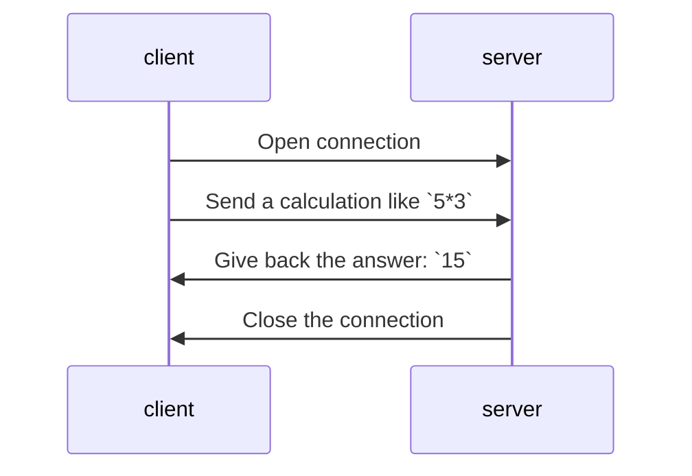
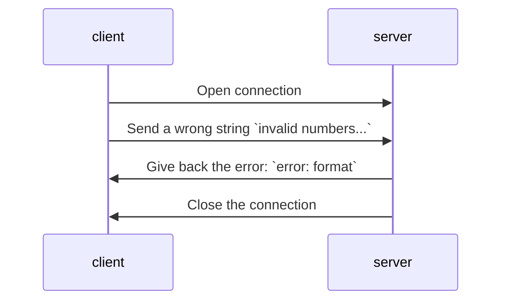
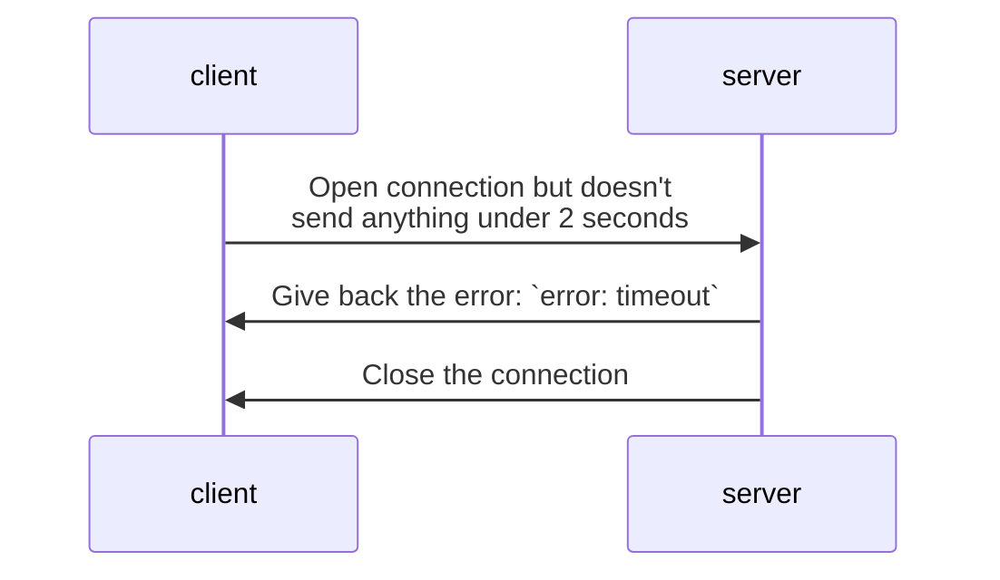
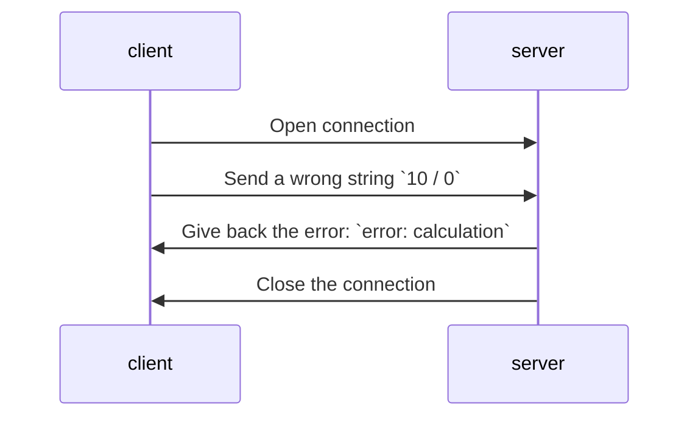

# Calculation protocol
This is the protocol specification of a simple calculation server that supports 2 operands calculation with various formats. We are using TCP and Java sockets. This is the role of the server to close the connection after the calculation is done. It means only one calculation can be done by the server.

## Features
1. **Various numbers formats**
   1. Multiple digits supports
   1. Only supports 2 operands, it the client gives more it will fail the validation
   1. Sign support (`+` or `-` or nothing)
   1. Floating numbers with at max 2 decimals in the request and answer
1. **Supported calculations**
   1. A sum: `5 + 15` and server answers `20`
   1. A substraction: `15 + -2` and server answers `17`
   1. A multiplication: `-1.50 *4` and server answers `-6`
   1. A division: `10/3` and server answers `3.34` (the value is rounded to the nearest 2 decimals value -> `3.3333333` rounded to `3.34`)
1. **Validation**
   1. The request format must match the following regular expression:  
   `^([+-]?(\d+(\.\d{1,2})?)) *[+-/*] *([+-]?(\d+(\.\d{1,2})?))$`.  
   1. Spaces around the operators are optional (valid examples: `5*    3`, `5*3`, `5  *  3`, `5*3`)
   1. The value can contains optionnaly spaces before and after, the line read is trimmed (`String.trim()`) before we try to validate it with our regex
1. **Errors management:**
   1. The client doesn't send anything under 2 seconds, the server responds with `error: timeout`
   1. In case the calculation fails, the server responds with `error: calculation`
   1. In case the format is invalid (doesn't match the regex), the server responds with `error: format`

## Sequence diagrams
**A few diagrams to showcase the above features**

Valid format:

Invalid format:

Timeout error:

Calculation error:
